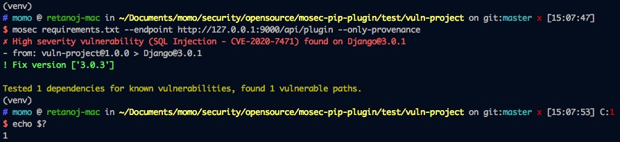

# MOSEC-PIP-PLUGIN

用于检测python项目的第三方依赖组件是否存在安全漏洞。

该项目是基于 [snyk-python-plugin](https://github.com/snyk/snyk-python-plugin.git) 的二次开发。


## 关于我们

Website：https://security.immomo.com

WeChat:

<br>


## 版本要求

Python 3.x


## 安装

```
pip install git+https://github.com/momosecurity/mosec-pip-plugin.git
```


## 使用

首先运行 [MOSEC-X-PLUGIN Backend](https://github.com/momosecurity/mosec-x-plugin-backend.git)

```
> cd your_python_project_dir/
> mosec requirements.txt --endpoint http://127.0.0.1:9000/api/plugin --only-provenance

// 或
> mosec setup.py --endpoint http://127.0.0.1:9000/api/plugin --only-provenance
```


## 卸载

```
> pip uninstall mosec-pip-plugin
```


## 帮助

```shell script
> mosec --help

usage: mosec [-h] --endpoint ENDPOINT [--allow-missing] [--only-provenance]
             [--level LEVEL] [--debug]
             requirements

positional arguments:
  requirements         依赖文件 (requirements.txt 或 Pipfile)

optional arguments:
  -h, --help           show this help message and exit
  --endpoint ENDPOINT  上报API
  --allow-missing      忽略未安装的依赖
  --only-provenance    仅检查直接依赖
  --level LEVEL        威胁等级 [High|Medium|Low]. default: High
  --debug
```


## 使用效果

以 test/vuln-project 项目为例。

红色部分给出漏洞警告，from: 为漏洞依赖链，Fix version 为组件安全版本。

程序返回值为1，表示发现漏洞。返回值为0，即为未发现问题。




## 检测原理

MOSEC-PIP-PLUGIN 核心使用`pkg_resources`内置库来提取当前python环境所安装的依赖。

并将环境依赖与传入的requirements.txt等文件中所声明的项目需要的依赖进行比对，从而构造当前项目所需的依赖的依赖树。

最终依赖树会交由 [MOSEC-X-PLUGIN-BACKEND](https://github.com/momosecurity/mosec-x-plugin-backend.git) 检测服务进行检测，并返回结果。

相关数据结构请参考 MOSEC-X-PLUGIN-BACKEND [README.md](https://github.com/momosecurity/mosec-x-plugin-backend/blob/master/README.md).


## 开发

#### Pycharm 调试 mosec-pip-plugin

程序入口位于`mosec/pip_resolve.py`文件的`main()`函数